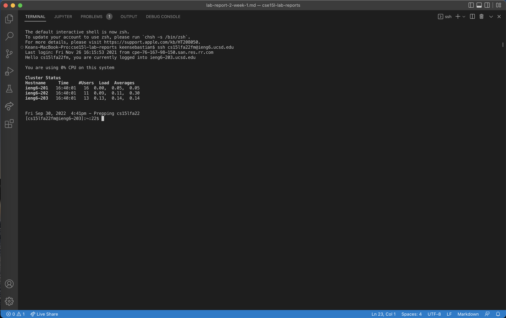

# **Lab Report 1**

## **Installing Visual Studio Code**
First, go to [https://code.visualstudio.com/]( https://code.visualstudio.com/) and install the correct version of Visual Studio Code for your specific operating system (macOS or Windows). Installation instructions will be provided for each operating system.
Once installed, open Visual Studio Code and the home page will look something like this:


*In my case, I already had Visual Studio Code installed on my computer, so I did not need to complete this step*

---

## **Remotely Connecting**
The next step is to connect to a remote computer using your CSE 15L account.

*If you are using Windows, you will need to first install OpenSSH from [this website](https://docs.microsoft.com/en-us/windows-server/administration/openssh/openssh_install_firstuse).*

Remote connection will happen using a terminal in Visual Studio Code. In the terminal, enter the following command (replace  `zz` with your username):

```
$ ssh cs15lfa22zz@ieng6.ucsd.edu
```

The first time you login, you will get a message similar to the following:

```
# On your client
⤇ ssh cs15lfa22fm@ieng6.ucsd.edu
The authenticity of host 'ieng6-202.ucsd.edu (128.54.70.227)' can't be established.
RSA key fingerprint is SHA256:ksruYwhnYH+sySHnHAtLUHngrPEyZTDl/1x99wUQcec.
Are you sure you want to continue connecting (yes/no/[fingerprint])? 
Password:
```

Type `yes`, then enter your password. The terminal will display this information once initial setup is complete:



You are now connected to a remote computer and can now run any commands.

---

## **Trying Some Commands**
Now you can try running some commands on the remote computer. Some of these commands include `cd`, `ls`, `pwd`, `mkdir`, and `cp`.

Some commands that I tried are shown below:

.png)

Specifically, I used `cd ~`, `cd`, `ls -lat`, `ls -a`,
`cp /home/linux/ieng6/cs15lfa22/public/hello.txt ~/` and
`cat /home/linux/ieng6/cs15lfa22/public/hello.txt`.

To disconnect from the remote computer, use Ctrl+D or use the `exit` command.

---

## **Moving Files with `scp`**
To copy a file from your personal computer to a remote computer, use the `scp` command. This command is run from the client computer (your computer). I created a file called `WhereAmI.java` and pasted the following code into it:

```
class WhereAmI {
  public static void main(String[] args) {
    System.out.println(System.getProperty("os.name"));
    System.out.println(System.getProperty("user.name"));
    System.out.println(System.getProperty("user.home"));
    System.out.println(System.getProperty("user.dir"));
  }
}
```

I then ran the following `scp` command:

`scp WhereAmI.java cs15lfa22zz@ieng6.ucsd.edu:~/`

Then, after logging back into the remote computer, compile and run the `.java` file by running these commands:

```
javac WhereAmI.java
java WhereAmI
```

The results of these commands are shown in the following screenshot:

.png)

---

## **Setting an SSH Key**
Next, to make logging in quicker, it is useful to set up an SSH key. This makes it so that you don't need to enter your password every time you login to the remote computer. To do this, run the `ssh-keygen` command on the client computer. The full commands are as follows:

```
# on client (your computer)
$ ssh-keygen
Generating public/private rsa key pair.
Enter file in which to save the key (/Users/keensebastian/.ssh/id_rsa : /Users/keensebastian/.ssh/id_rsa
Enter passphrase (empty for no passphrase): 
Enter same passphrase again:
```

*No need to enter a passphrase*

Once the key is generated, copy the public key to the `.ssh` directory of your remote computer account. Use the following commands to do this:

```
# on server
$ mkdir .ssh
$ <logout>
```

```
# on client
$ scp /Users/keensebastian/.ssh/id_rsa.pub cs15lfa22fm@ieng6.ucsd.edu:~/.ssh/authorized_keys
# You use your username and the path you saw in the command above
```

Finally, enter your password and the key will work next time you login to the remote computer.

The entire process is depicted in the screenshots below:

.png)
.png)

---

## **Optimizing Remote Running**
Lastly, there are a few tricks that can be used to make running commands much quicker.

One trick is to write a command in quotes at the end of the usual `ssh` command for logging into the remote computer. This command will run immediately after you are logged in.

```
$ ssh cs15lfa22fm@ieng6.ucsd.edu "ls"
```

Another trick is to run multiple commands from the same line. This can be done by using semicolons to separate different commands.

```
$ cp WhereAmI.java OtherMain.java; javac OtherMain.java; java WhereAmI
```

Finally, the up arrow on the keyboard can be used to pull up commands that were run previously, so you can easily run them again.

I use these tricks as displayed in the screenshot below:

.png)