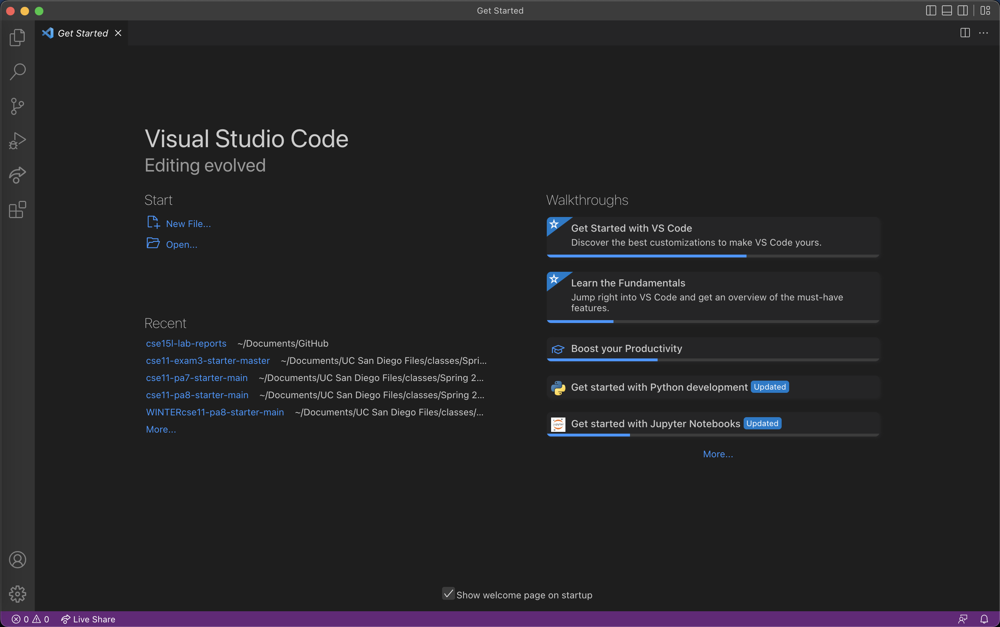

# **Lab Report 2**

## **Installing Visual Studio Code**
### First, go to [https://code.visualstudio.com/]( https://code.visualstudio.com/) and install the correct version of Visual Studio Code for your specific operating system (macOS or Windows). Installation instructions will be provided for each operating system.
### Once installed, open Visual Studio Code and the home page will look something like this:



*In my case, I already had Visual Studio Code installed on my computer, so I did not need to complete this step*

---

## **Remotely Connecting**
### The next step is to connect to a remote computer using your CSE 15L account.

*If you are using Windows, you will need to first install OpenSSH from [this website](https://docs.microsoft.com/en-us/windows-server/administration/openssh/openssh_install_firstuse).*

### Remote connection will happen using a terminal in Visual Studio Code. In the terminal, enter the following command (replace  `zz` with your username):

```
$ ssh cs15lfa22zz@ieng6.ucsd.edu
```

### The first time you login, you will get a message similar to the following:

```
# On your client
⤇ ssh cs15lfa22zz@ieng6.ucsd.edu
The authenticity of host 'ieng6-202.ucsd.edu (128.54.70.227)' can't be established.
RSA key fingerprint is SHA256:ksruYwhnYH+sySHnHAtLUHngrPEyZTDl/1x99wUQcec.
Are you sure you want to continue connecting (yes/no/[fingerprint])? 
Password:
```

### Type `yes`, then enter your password.

---

## **Trying Some Commands**
### asdf

---

## **Moving Files with `scp`**
### asdf

---

## **Setting an SSH Key**
### asdf

---

## **Optimizing Remote Running**
### asdf