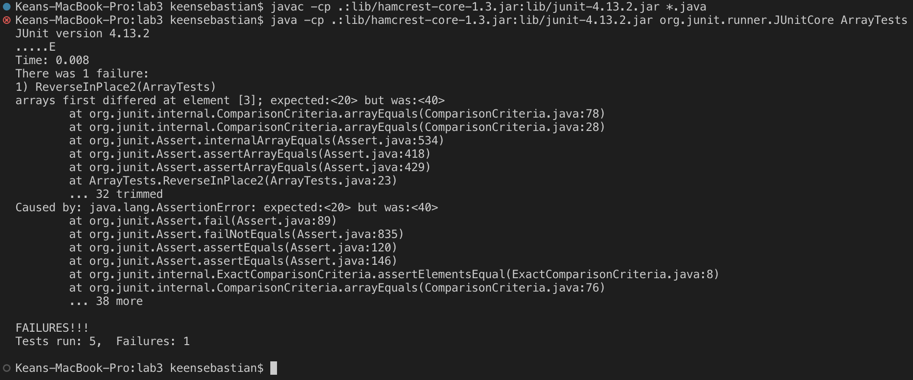

# **Lab Report 2**

## **Part 1: Simplest Search Engine**
### Code:
```
import java.io.IOException;
import java.net.URI;
import java.util.ArrayList;

class Handler implements URLHandler {
    String word = "";
    String key = "";
    ArrayList<String> list = new ArrayList<String>();
    ArrayList<String> searched = new ArrayList<String>();
    ArrayList<String> noDuplicates = new ArrayList<String>();

    public String handleRequest(URI url) {
        System.out.println("Path: " + url.getPath());

        if (url.getPath().equals("/")) {
            return String.format("Search Engine");
        }
        else if (url.getPath().contains("/add")) {
            String[] parameters = url.getQuery().split("=");
            if (parameters[0].equals("s")) {
                word = parameters[1];
                list.add(word);
                return String.format("Word added: %s!", word);
            }
        }
        else if (url.getPath().contains("/search")) {
            String[] parameters = url.getQuery().split("=");
            if (parameters[0].equals("s")) {
                key = parameters[1];
                for(String s : list) {
                    if(s.contains(key)) {
                        searched.add(s);
                    }
                }          

                for(String s: searched) {
                    if (!noDuplicates.contains(s)) {
                        noDuplicates.add(s);
                    }
                }

                return String.format("Found %s in %s", key, noDuplicates);
            }
        }
        return "404 Not Found!";
    }
}

class SearchEngine {
    public static void main(String[] args) throws IOException {
        if(args.length == 0){
            System.out.println("Missing port number! Try any number between 1024 to 49151");
            return;
        }

        int port = Integer.parseInt(args[0]);

        Server.start(port, new Handler());
    }
}
```
### Screenshots:
.png)

In the first screenshot, I add the String "jet" to the list of words.

The method that is used here is the handleRequest() method, which takes the url as the argument. Since the url contains "/add" the program follows the corresponding else-if statement, and gets the string that is entered after the "=".

The String field `word` is set to "jet", and this `word` is added to the ArrayList field `list`.

.png)

In the second screenshot, I add the String "jetstream" to the list of words.

Like the first screenshot, the handleRequest() method is used here, and it takes the url as the argument. The url contains "/add" so the program follows the corresponding else-if statement, and gets the string that is entered after the "=".

This time, the String field `word` is set to "jetstream", and this `word` is added to the ArrayList field `list`.


In the third screenshot, I search for the substring "stream" among the words that are currently in my wordlist.

The handleRequest() method is called again with the url as the argument but this time, the url contains "/search" so the program follows the corresponding else-if statement and checks if the words in `list` contain the String entered after the "=".

A for-loop iterates through the Strings in `list` and adds valid Strings to a new ArrayList called `searched`. Then, another for-loop is used to handle duplication errors and remove duplicated items, and add the valid String to another ArrayList called `noDuplicates`.

The ArrayList field `searched` contains the element ["jetstream"] (possibly duplicated), and the ArrayList field `noDuplicates` contains the element ["jetstream"].

---

## **Part 2: Bugs**
### `reverseInPlace()` (ArrayExamples.java)
Failure-inducing input:

The failure-inducing input in this test was the array ```{10, 20, 30, 40, 50}```.


Symptom:

The symptom was an error in which the element at index 3 was expected to be 20, but it was actually 40.



Bug:

The bug was that the elements in the first half of the array were being lost when being replaced by elements in the latter half.


Fix:

The fix involved storing the elements from the first half of the array in a temporary variable so that they could be retrieved later. It also involved changing the for-loop so that it would only iterate until the middle element of the array. *(Otherwise, the loop would end up undoing the reversal).*


Connection between symptom and bug:

The symptom indicated that the element at the third index was being replaced with 40. This means that the element was being replaced by itself. This is because when the for-loop reached index 3, the program replaced that element with the element at the first index. However, the program replaced the element at index 1 with that at index 3, which was 40. Thus, 40 was replaced with 40.

The bug causes this particular symptom for this particular input because there was no way of storing the elements from the first half of the array. These elements were being replaced correctly, but the original values were lost as a result.


### `append()` (LinkedListExample.java)
Failure-inducing input:

The failure-inducing input in this test was the series of calls to the ```append()``` method of the LinkedList class.


Symptom:

The symptom was an infinite loop that occurred when trying to run the test.


Bug:

The bug was that, if there were more than two Nodes in the LinkedList, new Nodes would continuously be appended because of the while-loop. The while condition would never be broken as a new Node was added, so new Nodes would keep on being added.


Fix:

The fix involved taking the ```n.next = new Node(value, null);``` line out of the while-loop, so only one new Node would be added for each call of the ```append``` method.


Connection between symptom and bug:

The symptom indicated that the program was running in an infinite loop. This means that the append method was continuously adding new Nodes to the LinkedList. This is because when the program reached the while-loop, a new Node was appended such that the condition ```n.next != null``` would never be violated. Thus, the while-loop never ended.

The bug causes this particular symptom for this particular input because more than two Nodes were already in the LinkedList when the last Node was appended. If there were less nodes in the LinkedList before the last call of ```append()```, the program would never reach the while loop, and the symptom would not be encountered.


