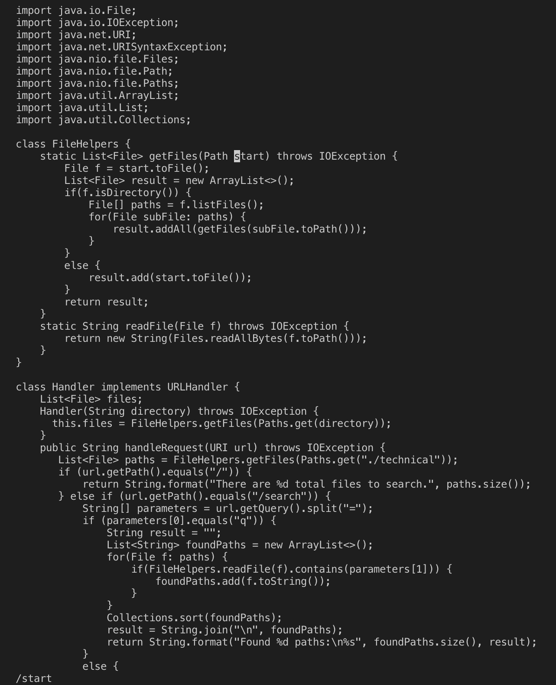
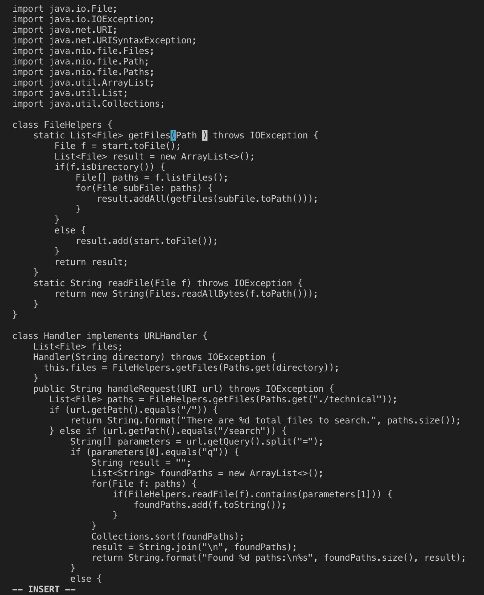
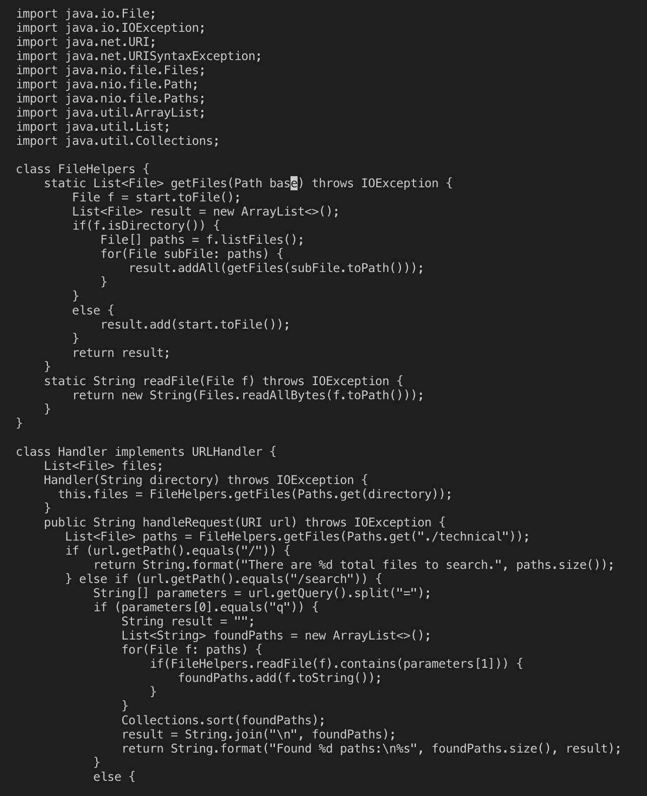
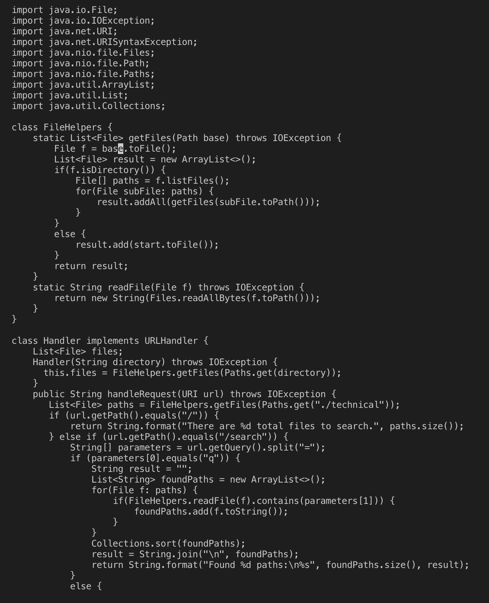
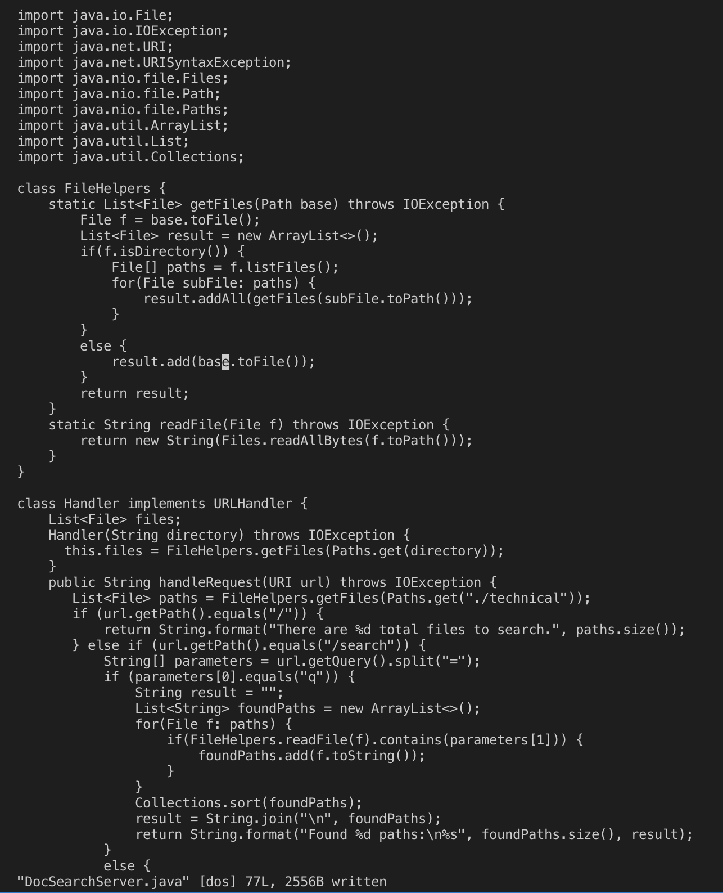

# **Lab Report 4**

## **Part 1: Week 6 Vim Task**
```
/start<Enter>cebase<Esc>n.n.:w<Enter>
```

```/start<Enter>```

Search for start.


```ce```

Delete start and enter Insert Mode.


```base<Esc>```

Insert base and exit Insert Mode.


```n.```

Repeat search for and delete start, repeat insert base.


```n.```

Repeat search for and delete start, repeat insert base.


```:w<Enter>```

Save changes.


---

## **Part 2: Running Vim Remotely**
### Method 1: Visual Studio Code then ```scp``` ###
Time: 56 seconds
Difficulties: None

### Method 2: Vim from Remote Server ###
Time: 24 seconds
Difficulties: None

### Which of these two styles would you prefer using if you had to work on a program that you were running remotely, and why? ###
* If I was already logged into the remote server, I would prefer to make edits using Vim because I would not have to exit the remote server. Using the first method, I would have to leave the remote server, make the edit, then copy it over and log back in again. Although I generally prefer using Visual Studio Code, it would be much faster to use Vim in this situation.

### What about the project or task might factor into your decision one way or another? ###
* If I had to complete a task using a remote server while on a time limit, I would use Vim so I would not have to spend time copying files. However, for personal projects, having color-coding and the freedom to use the GUI in an IDE like Visual Studio Code would be more helpful to me.
