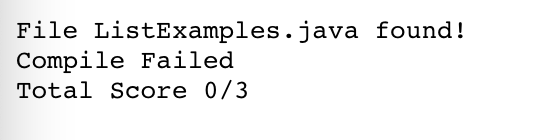
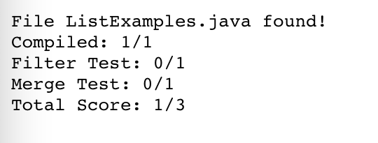
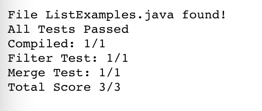

# **Lab Report 5**

## ```grade.sh```

```
rm -rf student-submission
git clone $1 student-submission &>/dev/null

cd student-submission

if [ -e ListExamples.java ]
then
    echo "File ListExamples.java found!"
    cp ListExamples.java ../
else
    echo "File ListExamples.java not found!"
    echo "Total Score 0/3"
    exit 1
fi

cd ../
javac -cp .:lib/hamcrest-core-1.3.jar:lib/junit-4.13.2.jar *.java &>/dev/null

if [ ! $? -eq 0 ]
then
    echo "Compile Failed"
    echo "Total Score 0/3"
    exit 1
fi

java -cp .:lib/hamcrest-core-1.3.jar:lib/junit-4.13.2.jar org.junit.runner.JUnitCore TestListExamples > TestResults.txt

if grep "OK" TestResults.txt &>/dev/null
then
    echo "All Tests Passed"
    echo "Compiled: 1/1"
    echo "Filter Test: 1/1"
    echo "Merge Test: 1/1"
    echo "Total Score 3/3"
    exit 0
fi

if grep "failures" TestResults.txt &>/dev/null
then
    echo "Compiled: 1/1"
    score=1

    if grep "testFilter" TestResults.txt &>/dev/null
    then
        echo "Filter Test: 0/1"
    else
        echo "Filter Test: 1/1"
        ((score=$score+1))
    fi

    if grep "testMerge" TestResults.txt &>/dev/null
    then
        echo "Merge Test: 0/1"
    else
        echo "Merge Test: 1/1"
        ((score=$score+1))
    fi
    
    echo "Total Score: $score/3"
    exit 0
fi
```

### Submission 1: https://github.com/ucsd-cse15l-f22/list-methods-compile-error



### Submission 2: https://github.com/ucsd-cse15l-f22/list-methods-lab3



### Submission 3: https://github.com/ucsd-cse15l-f22/list-methods-corrected



---

## Trace
### Submission 3: https://github.com/ucsd-cse15l-f22/list-methods-corrected
---
```
git clone $1 student-submission &>/dev/null
```
Standard Output:
```
Cloning into 'student-submission'...
remote: Enumerating objects: 4, done.
remote: Counting objects: 100% (4/4), done.
remote: Compressing objects: 100% (2/2), done.
remote: Total 4 (delta 0), reused 4 (delta 0), pack-reused 0
Unpacking objects: 100% (4/4), done.
```
Standard Error: None

Return Code: 0

---

```
if [ -e ListExamples.java ]
then
    echo "File ListExamples.java found!"
    cp ListExamples.java ../
else
    echo "File ListExamples.java not found!"
    echo "Total Score 0/3"
    exit 1
fi
```
Standard Output:
```
File ListExamples.java found!
```
Standard Error: None

Return Code: 0

The condition was true because the file name ListExamples.java existed in the student-submission directory and was found.

Thus, the lines contained in the else statement do not run.

---
```
javac -cp .:lib/hamcrest-core-1.3.jar:lib/junit-4.13.2.jar *.java &>/dev/null
```
Standard Output: None

Standard Error: None

Return Code 0

---
```
if [ ! $? -eq 0 ]
then
    echo "Compile Failed"
    echo "Total Score 0/3"
    exit 1
fi
```
Standard Output: None

Standard Error: None

Return Code: 0

The condition was false because the compile was successful and the Return Code of the compile was 0.

Thus, the lines contained in the if statement do not run.

---
```
java -cp .:lib/hamcrest-core-1.3.jar:lib/junit-4.13.2.jar org.junit.runner.JUnitCore TestListExamples > TestResults.txt
```
Standard Output (Redirected to TestResults.txt):
```
JUnit version 4.13.2
..
Time: 0.007

OK (2 tests)
```
Standard Error: None

Return Code: 0

---
```
if grep "OK" TestResults.txt &>/dev/null
then
    echo "All Tests Passed"
    echo "Compiled: 1/1"
    echo "Filter Test: 1/1"
    echo "Merge Test: 1/1"
    echo "Total Score 3/3"
    exit 0
fi
```
Standard Output:
```
All Tests Passed
Compiled: 1/1
Filter Test: 1/1
Merge Test: 1/1
Total Score 3/3
```
Standard Error: None

Return Code: 0

The condition was true because "OK" was found in TestResults.txt, which means that all the tests passed.

Thus, the lines contained within the if statement run.

---
```
if grep "failures" TestResults.txt &>/dev/null
then
    echo "Compiled: 1/1"
    score=1

    if grep "testFilter" TestResults.txt &>/dev/null
    then
        echo "Filter Test: 0/1"
    else
        echo "Filter Test: 1/1"
        ((score=$score+1))
    fi

    if grep "testMerge" TestResults.txt &>/dev/null
    then
        echo "Merge Test: 0/1"
    else
        echo "Merge Test: 1/1"
        ((score=$score+1))
    fi
    
    echo "Total Score: $score/3"
    exit 0
fi
```

Standard Output: None

Standard Error: None

Return Code: None

The condition was false because "failures" was not found in TestResults.txt, which means that no tests failed.

Thus, the lines and nested if/else statements contained within the outer if statement do not run.